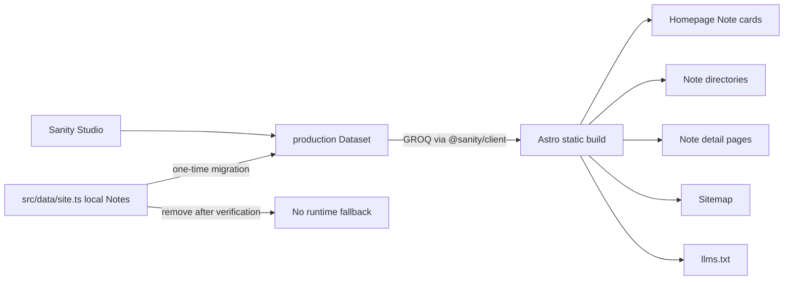

# Sanity Notes Single-Source Design

## Status

Approved direction: make Sanity the only source of truth for all bilingual Notes content in the Astro site.

This phase integrates Notes only. Projects, Services, Site Settings, draft preview, webhooks, automated deployment, and production release are explicitly outside this implementation scope.

## Goals

- Store every published Chinese and English Note in Sanity project `7lstorz2`, dataset `production`.
- Query published Notes through the Sanity Content Lake API during the Astro static build.
- Use Portable Text as the single article body model and keep FAQ as a separate structured field.
- Migrate all existing Notes from `src/data/site.ts` into Sanity without losing visible sections, list ordering, slugs, language, FAQ content, or bilingual pairing.
- Remove the exported local `notes` dataset after migration verification.
- Generate the homepage Note cards, Note directories, Note detail routes, Sitemap entries, and `llms.txt` entries from Sanity data only.
- Fail the build clearly when Sanity cannot be queried or when required migrated content is incomplete. Do not silently fall back to local content.
- Preserve all existing public Note URLs unless a migration validation explicitly rejects a collision or incomplete pair.

## Non-goals

- No production deployment in this phase.
- No draft preview or visual editing.
- No publish webhook or automatic server build.
- No migration of Projects, Services, company facts, navigation, or deployment settings.
- No client-side browser querying of Sanity.
- No GraphQL API.
- No local Note content fallback after cutover.

## Current State

The Astro site currently exports `notes` from `src/data/site.ts`. Every entry contains a shared slug and independent `en` and `zh` objects with these fixed fields:

- `title`
- `tag`
- `summary`
- `definition`
- `overview`
- `principles[]`
- `checklist[]`
- `examples[]`
- `next`
- `faq[]`

The current Note detail template renders those fields as a fixed sequence of sections. The homepage, Note directory, dynamic Note routes, Sitemap, and `llms.txt` all import the same local array.

The Sanity Note schema already contains bilingual identity, title, slug, summary, tags, Portable Text content, FAQ, SEO, and publication fields. The local fixed sections therefore need a deterministic one-time conversion into Portable Text.

## Chosen Architecture



Sanity is the only runtime/build-time source for Notes after migration. Astro continues to generate static HTML, so website visitors do not query Sanity directly.

## API Client

Add `@sanity/client`, `@sanity/image-url`, and `astro-portabletext` to the Astro project.

Create a server/build-only client with:

- project ID: `7lstorz2`
- dataset: `production`
- fixed API version: `2026-07-13`
- CDN reads enabled for published content
- no browser-exposed write token

Environment variables:

```text
PUBLIC_SANITY_PROJECT_ID=7lstorz2
PUBLIC_SANITY_DATASET=production
SANITY_API_VERSION=2026-07-13
```

The public project ID and dataset may be committed through `.env.example`. Any migration write credential must remain outside Git. Prefer running the migration through the authenticated Sanity CLI context so no persistent token is required in the repository.

## Canonical Note Model

Astro receives a normalized Note document with this shape:

```ts
type SanityNote = {
  _id: string;
  title: string;
  slug: string;
  language: "en" | "zh";
  translationKey: string;
  summary: string;
  tags: string[];
  content: PortableTextBlock[];
  faq: Array<{
    question: string;
    answer: PortableTextBlock[];
  }>;
  seo?: {
    title?: string;
    description?: string;
    keywords?: string[];
    noIndex?: boolean;
  };
  publishedAt: string;
  updatedAt?: string;
  featured?: boolean;
};
```

Required fields for a publishable page:

- title
- slug
- language
- translationKey
- summary
- content
- publishedAt

`tags[0]` becomes the visible directory-card and breadcrumb label. If no tag exists, the UI uses the localized generic Note label.

## Portable Text Migration Mapping

Each local Note language variant becomes one Sanity document. The current fixed sections convert in this order:

1. H2 localized Definition heading
2. Definition paragraph
3. H2 localized Overview heading
4. Overview paragraph
5. H2 localized Principles heading
6. Principles as a bullet list
7. H2 localized Checklist heading
8. Checklist as a numbered list
9. H2 localized Examples heading
10. Examples as a bullet list
11. H2 localized Next Steps heading
12. Next paragraph

FAQ remains outside the main body and converts each plain-text answer into a Portable Text paragraph block.

Migration identity rules:

- Document ID: deterministic from language and translation key, for example `note.ai-agent-workflow.zh`.
- Draft IDs are not created.
- Existing shared slug is retained for both languages unless the source differs in a future migration.
- Both language variants retain the same `translationKey`.
- `tag` becomes `tags: [tag]`.
- `publishedAt` receives a deterministic migration timestamp rather than changing on every rerun.
- Re-running the migration replaces the deterministic documents instead of creating duplicates.

## Queries

Create focused GROQ queries instead of one oversized global query:

- `getAllPublishedNotes()` for build orchestration, homepage cards, directories, Sitemap, and `llms.txt`.
- `getPublishedNote(language, slug)` only if a later server-rendered mode requires it; static generation should normally pass queried documents through `getStaticPaths()` props.
- `getTranslationPair(translationKey)` may be derived from the all-notes build result without another network request.

Published queries must exclude drafts and require a defined slug.

Sorting:

1. `featured desc`
2. `publishedAt desc`
3. `title asc`

## Build Data Flow

Create `src/lib/sanity/client.ts`, `src/lib/sanity/queries.ts`, and `src/lib/sanity/notes.ts`.

`notes.ts` owns:

- fetching Sanity Notes
- runtime response validation
- duplicate route detection
- bilingual pairing lookup
- localized collection helpers
- conversion of Portable Text FAQ answers to plain text for JSON-LD

All build consumers call this shared data layer. They must not issue independent ad hoc queries because that creates inconsistent snapshots and unnecessary network calls.

The shared fetch may be memoized at module scope so one Astro build uses one consistent dataset snapshot.

## Route Generation

`src/pages/[lang]/notes/[slug].astro` becomes fully Sanity-driven.

`getStaticPaths()`:

1. fetches the complete validated published Note set;
2. emits one route per Sanity document;
3. passes the document and optional translated pair in props;
4. rejects duplicate `language + slug` routes;
5. rejects migrated translation keys that do not contain both `en` and `zh` variants during the initial cutover.

Alternate-language links use the paired document's actual slug, not the current document's slug by assumption.

## Rendering

The Note detail page preserves the current outer visual system:

- BaseLayout
- breadcrumb
- title
- summary lede
- content-page spacing
- FAQ details component
- Article JSON-LD
- FAQPage JSON-LD

The fixed local section grid is replaced by a Portable Text renderer.

Portable Text components explicitly render:

- paragraphs
- H2/H3
- blockquotes
- bullet and numbered lists
- strong, emphasis, and inline code
- HTTP/HTTPS/mailto/tel links
- images with required alt text and optional captions
- code blocks with optional filename and language

Unknown block types must produce a build-time warning with the document ID and block type. Required unsupported content should fail validation before production deployment.

## Homepage and Directory Integration

The homepage and bilingual Note directory query Sanity through the shared build data layer.

Cards use:

- localized title
- summary
- first tag or localized generic label
- Sanity slug

No local Note card remains after cutover.

## SEO, Sitemap, and llms.txt

The Note detail page uses:

- `seo.title` when present, otherwise document title
- `seo.description` when present, otherwise summary
- `seo.noIndex` to control robots metadata
- actual translated-pair slug for hreflang
- FAQ structured data generated from the separate FAQ field

`allSeoPaths()` can no longer synchronously append local Note paths. Static non-Note paths remain local, while Sitemap generation asynchronously adds Sanity Note routes.

`llms.txt` similarly fetches Sanity Notes and emits bilingual URLs from the queried documents.

If Sanity fetching or validation fails, Sitemap, `llms.txt`, and the main Astro build fail together. They must never publish a partial disagreement.

## Single-Source Cutover Sequence

1. Extend the Astro-side tests to describe expected Sanity integration behavior.
2. Add dependencies and the shared Sanity data layer.
3. Add a deterministic migration script.
4. Run the migration against `production`.
5. Query Sanity and compare migrated counts, languages, slugs, translation keys, and FAQ counts against the local source.
6. Update Note pages, homepage, Sitemap, and `llms.txt` to consume Sanity.
7. Run full Astro verification while local Notes still exist only as migration input.
8. Remove the local `notes` export and obsolete Note content type from `src/data/site.ts`.
9. Run verification again to prove the build has no local Notes dependency.
10. Disable network access or intentionally supply an invalid Sanity project ID and verify that the build fails clearly.
11. Restore the valid configuration and run a final successful build.
12. Do not deploy production in this phase.

## Failure Semantics

There is no fallback.

The build must fail with actionable messages for:

- Sanity network/query errors
- empty Note dataset after migration
- malformed API responses
- missing required fields
- unsupported language
- duplicate `language + slug`
- duplicate deterministic document IDs
- incomplete initial bilingual migration pairs
- Portable Text content with unsupported required blocks

Error messages include the document ID, language, slug, and failing field when available.

## Testing Strategy

Add Node tests that verify:

- GROQ query excludes drafts and requires slugs.
- response validation rejects malformed Notes.
- duplicate routes fail.
- bilingual pairing resolves different translated slugs correctly.
- migration converts paragraphs and list ordering deterministically.
- migration reruns preserve deterministic document IDs.
- Sitemap and `llms.txt` include all migrated Note routes.
- built Chinese and English Note pages render migrated section headings, list content, FAQ, Article JSON-LD, and FAQPage JSON-LD.
- no source file imports the removed local `notes` export.
- invalid Sanity configuration causes a non-zero build exit.

Required verification commands:

```bash
npm run astro -- check
npm test
npm run verify
```

The final verification records the queried Sanity document count and expected bilingual route count.

## Security

- Published reads use the public dataset without a write token.
- No API token appears in client-side JavaScript, committed environment files, tests, logs, or generated HTML.
- Migration credentials are temporary, local, and write-scoped only as necessary.
- Drafts are not queried in the public build.
- The website never exposes Sanity mutation operations.

## Rollback Before Deployment

Because this phase does not deploy production, rollback is Git-only:

- revert the Astro integration commit;
- the existing production site remains unchanged;
- migrated Sanity documents may remain because they are not yet consumed by production;
- do not delete migrated Sanity documents until the implementation is accepted.

## Acceptance Criteria

- Sanity contains every previous local Note in both languages.
- Migration validation proves expected count, unique routes, complete pairs, and FAQ preservation.
- `src/data/site.ts` no longer exports Note content.
- No Astro source imports local Notes.
- Homepage, directories, details, Sitemap, and `llms.txt` use Sanity only.
- Existing public Note URLs build successfully.
- Portable Text and FAQ render correctly in both languages.
- A broken Sanity configuration fails the build.
- Valid configuration passes `astro check`, tests, and production build.
- No production deployment occurs without a separate explicit instruction.
